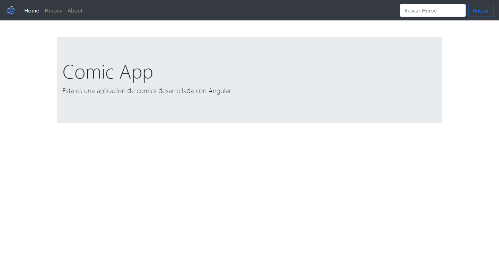
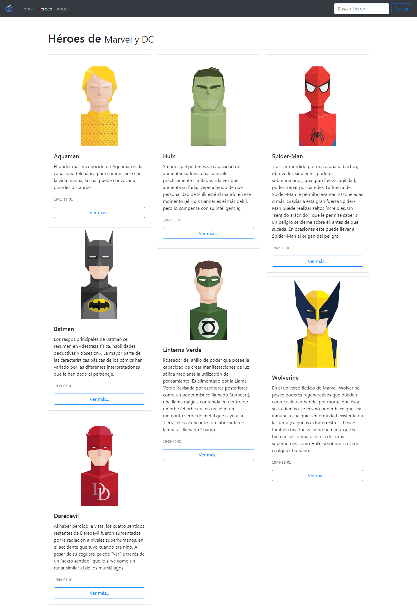
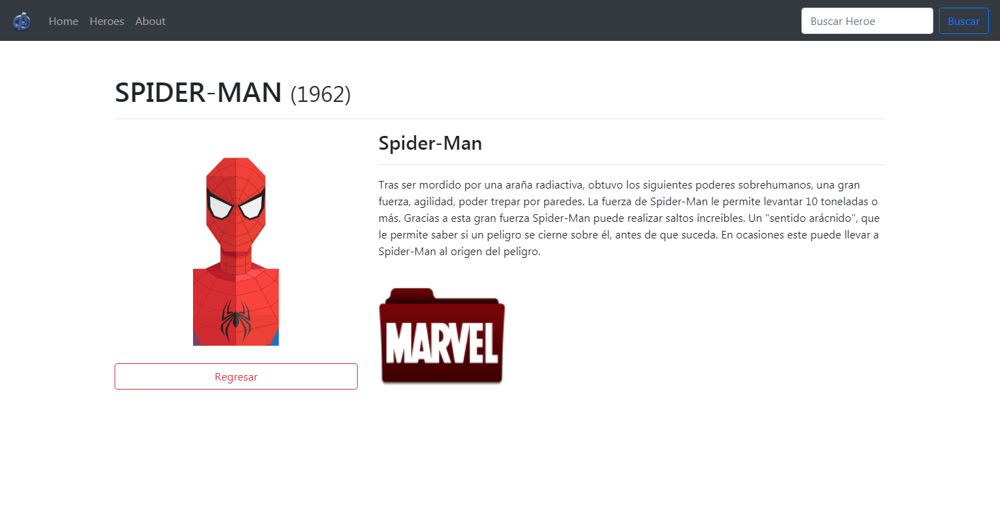
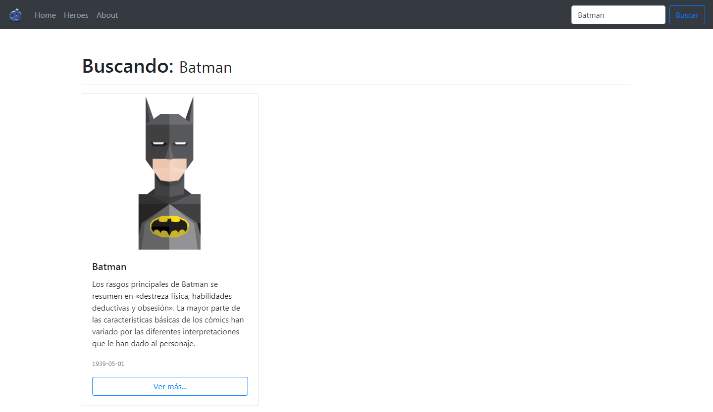
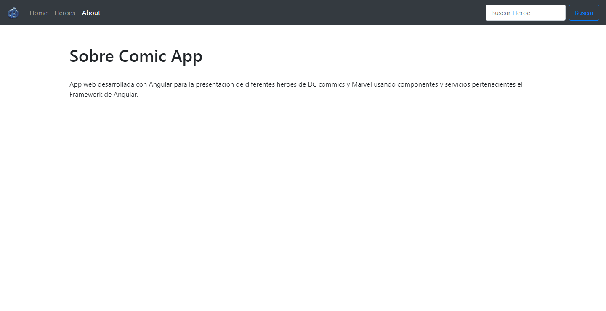

# SpaSuperheroAngular

App web desarrollada con Angular para la presentacion de diferentes heroes de DC commics y Marvel usando componentes y servicios pertenecientes el Framework de Angular.

## Instrucciones:

1. Descarga las dependencias con `npm install` 
2. Escribe `ng serve` para levantar un servidor local con Angular.
3. Navega al `http://localhost:4200/`. La aplicacion automáticamente se recargará con los cambios que se hagan.

